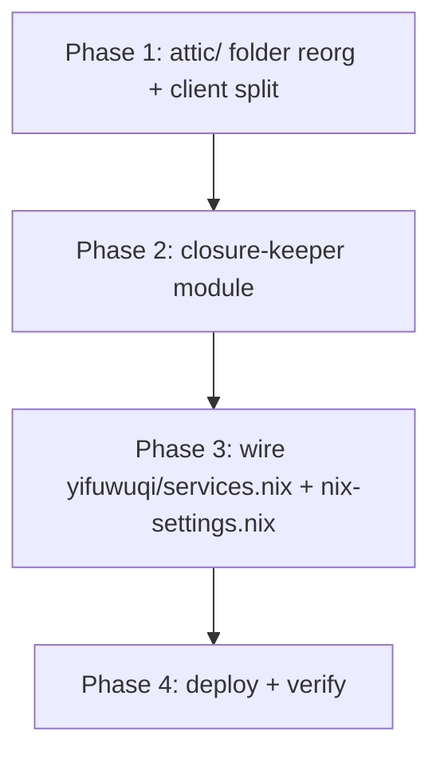

# Attic Cache Hardening: Closure Keeper + Module Reorganization

## Objective

Prevent recurrence of the Nix/Lix daemon crash (`DerivationGoal::outputsSubstitutionTried: Assertion 'false' failed`, [NixOS/nix#10092](https://github.com/NixOS/nix/issues/10092)) when building `nixosConfigurations.*`, while:

1. **Keeping attic garbage collection** (storage is constrained — no free disk to waste).
2. **Avoiding build wrappers** — no scripts wrapping `nh os build` / `nixos-rebuild`.
3. **Consolidating all attic-related modules** into a dedicated `modules/services/attic/` folder.

---

## Current State

- **The incident**: `nh os build .#yitaishi` from `yifuwuqi` crashes with `stream ended unexpectedly`; the Lix daemon core-dumps with `outputsSubstitutionTried: Assertion 'false' failed` (`lix/libstore/build/derivation-goal.cc:333`).
- **Root cause** (verified empirically):
  - The Nix/Lix scheduler asserts when a binary cache advertises an **incomplete closure** (`nrIncompleteClosure == nrFailed` → `retrySubstitution = YesNeed` → second pass hits `assert(false)`).
  - `cache.fufu.land/yi` serves incomplete closures because:
    - **atticd GC** (`modules/services/atticd.nix`) runs with `default-retention-period = "1 days"` and deletes objects **individually with no closure awareness** (`server/src/gc.rs`, `Object::delete_many()` filtered only by age/access).
    - **attic watch-store** (`modules/services/attic-watch-store.nix`) panics (`client/src/command/watch_store.rs:116` `queue_many().unwrap()` on a closed channel), leaving interrupted/partial pushes.
    - **flake.lock input bumps** change leaf paths → the cache is temporarily "mostly there" until hosts rebuild and push.
  - **Not the refactor**: the crash reproduces on the remote `develop` branch (pre-refactor) and with both Lix 2.95.2 and official Nix 2.34.8. Upstream fix not yet available (persists through Nix 2.23.1 / 2.34.8 and Lix 2.95.2).
- **Current attic layout**: flat files `modules/services/atticd.nix` and `modules/services/attic-watch-store.nix`, imported only by `hosts/yifuwuqi/services.nix`. `modules/nix-settings.nix` (imported by all 5 hosts) hardcodes the attic substituter URL + trusted public key. `yifuwuqi` is the sole attic server and sole pusher (`nix-builder`, `tokens/attic-push-token` sops secret).

---

## Decisions

1. **Option A — keep `attic-watch-store` + add a `closure-keeper` repair timer.**
   - `attic-watch-store` stays as the fast, real-time forward-push of newly built paths (its panic is tolerable because the keeper repairs).
   - `attic-closure-keeper` is a **background repair loop** (systemd oneshot + timer, no CLI wrapper) that re-verifies every current system head's full closure is present in the cache and re-pushes whatever GC or a partial push removed.
2. **Keep attic GC as-is** (storage constraint). The keeper makes GC safe: it re-pushes pruned paths for current heads, so the cache converges to "current heads' closures + recent" — bounded storage.
3. **No build wrappers.** All mechanisms are background services or config lines.
4. **Dedicated attic folder** `modules/services/attic/` housing server, watch-store, closure-keeper, and the client substituter config; old flat files deleted.
5. **Accept a residual window**: the very first build after a flake.lock bump can still crash (changed leaf paths don't exist anywhere yet — nothing to re-push). Mitigate by retrying (the crash is a nondeterministic race), and optionally test `nix.settings.max-substitution-jobs = 1` (a config line, not a wrapper).

---

## Phases & Implementation Details

### Phase 1: Reorganize into `modules/services/attic/`

| New file | Source |
|---|---|
| `modules/services/attic/server.nix` | ← `modules/services/atticd.nix` (moved, unchanged) |
| `modules/services/attic/watch-store.nix` | ← `modules/services/attic-watch-store.nix` (moved, unchanged) |
| `modules/services/attic/client.nix` | new — attic substituter + trusted key extracted from `modules/nix-settings.nix` |
| `modules/services/attic/closure-keeper.nix` | new — the repair timer (Phase 2) |

- Delete `modules/services/atticd.nix` and `modules/services/attic-watch-store.nix`.
- `attic/client.nix`:
  ```nix
  { lib, ... }:
  {
    nix.settings = {
      substituters = lib.mkBefore [ "https://cache.fufu.land/yi" ];
      trusted-public-keys = lib.mkBefore [ "yi:wLUC4OacKKUxGtnXwIxTFGBlLwvJ9IU4BNP5OBDQO60=" ];
    };
  }
  ```
- `modules/nix-settings.nix`: remove the attic entry from `substituters` and `trusted-public-keys`, add `imports = [ ./services/attic/client.nix ];`. `mkBefore` keeps attic first (priority 38), preserving today's behavior on all 5 hosts (they all import `nix-settings.nix`).

### Phase 2: `modules/services/attic/closure-keeper.nix`

Mirror `watch-store.nix`'s scaffolding (host assertion `yifuwuqi`, same `tokens/attic-push-token` sops secret, `User = "nix-builder"`, `StateDirectory`, `LoadCredential`, `path = [ atticClient ]`).

**Oneshot `attic-closure-keeper.service`:**
```bash
export HOME="/var/lib/attic-closure-keeper"
ATTIC_TOKEN=$(< "$CREDENTIALS_DIRECTORY/attic-push-token")
attic login yi http://127.0.0.1:18203 "$ATTIC_TOKEN"
shopt -s nullglob
printf '%s\n' /nix/store/nixos-system-* |
  attic push yi:yi --stdin --ignore-upstream-cache-filter -j 10
```

- `attic push --stdin` computes each head's **full closure** and uploads **only what's missing** (idempotent; cheap when the cache is complete).
- `--ignore-upstream-cache-filter` matches watch-store's push policy so attic coverage stays complete (never partial by design).
- No heads present → attic prints `Nothing specified.` and exits 0.

**Timer `attic-closure-keeper.timer`:**
```nix
wantedBy = [ "timers.target" ];
timerConfig = {
  OnBootSec = "1m";
  OnUnitActiveSec = "15m";
  Persistent = true;
};
```

### Phase 3: Wiring

- `hosts/yifuwuqi/services.nix` — replace:
  ```nix
  ../../modules/services/atticd.nix
  ../../modules/services/attic-watch-store.nix
  ```
  with:
  ```nix
  ../../modules/services/attic/server.nix
  ../../modules/services/attic/watch-store.nix
  ../../modules/services/attic/closure-keeper.nix
  ```
- `modules/nix-settings.nix` — as in Phase 1.

### Phase 4: Verification

1. Eval all 6 configs (`nixosConfigurations.{yitaishi,yixiaoqing,yifuwuqi,yirukou,yichuang}` + `homeConfigurations.yijia`) — no stale attic paths, new module paths resolve.
2. `nh os build .#yifuwuqi` (or eval) — `attic-closure-keeper.{service,timer}` present, old `atticd.nix`/`attic-watch-store.nix` gone.
3. `systemctl start attic-closure-keeper.service` → journal shows push/skip of heads.
4. `systemctl list-timers attic-closure-keeper`.
5. Confirm a previously-missing narinfo returns to `200` on `https://cache.fufu.land/yi`.

---

## Rollout Order



1. **Step 1**: Reorganize modules (pure move + client extraction). Verify configs still eval identically.
2. **Step 2**: Add the closure-keeper service + timer.
3. **Step 3**: Deploy on `yifuwuqi` (`nh os switch .#yifuwuqi`), start the keeper, confirm repair behavior.
4. **Step 4**: Run `nh os build .#yitaishi` to confirm the crash is gone with the cache maintained.

---

## Open Questions & Review Items

1. **Cadence**: is `15m` the right timer interval, or should it be faster (e.g. `2m`, since each run is cheap — localhost narinfo checks + only-missing uploads)? Faster shrinks the post-GC crash window.
2. **Client config split**: OK to extract the attic substituter/key from `modules/nix-settings.nix` into `attic/client.nix`, or keep `nix-settings.nix` untouched and only move the three service modules?
3. **Head scope**: the keeper protects *all* `nixos-system-*` heads present in `yifuwuqi`'s store (simple, bounded). Should it later restrict to the newest head per host to save storage?
4. **`max-substitution-jobs` test**: worth testing `nix.settings.max-substitution-jobs = 1` (config line) to see if serializing substitutions also closes the residual flake.bump window?
5. **watch-store panic**: pin a newer attic revision if the `queue_many().unwrap()` panic (`watch_store.rs:116`) is fixed upstream — low priority since the keeper repairs.
