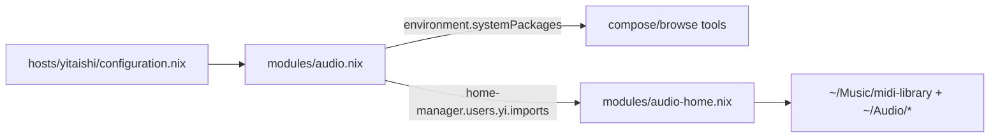

# MIDI Libraries, Compose Tools, and FX Presets (yitaishi / yi)

Add compose/authoring tools system-wide on `yitaishi`, declaratively fetch a small MIDI library set with real pinned hashes, and scaffold writable folders for NAM/IR/FX-chain presets. The `$HOME` content lives in a home module that is imported from inside `modules/audio.nix`, so the audio system config and its home content stay together and only apply on `yitaishi` (the only host importing `audio.nix`).

## Decisions (confirmed)

- **Fetch scope**: ldrolez chords + Magenta Groove + MAESTRO-midi + Lakh `clean_midi` subset. Heavy datasets (Lakh-full, LA-MIDI, Slakh2100) are intentionally left out of the store.
- **Systems**: MIDI library + plugin-preset/NAM-IR scaffolding + authoring/browse tools. No `yabridge`.
- **Host/user**: audio is only on `yitaishi`; content targets `yi` (uid 1000, in the `audio` group, home `/home/yi`).
- **Co-location (no flag)**: `modules/audio.nix` imports the home module via `home-manager.users.yi.imports = [ ./audio-home.nix ]`. This mirrors existing repo patterns (`modules/desktop/gnome.nix` uses `home-manager.sharedModules`; `modules/services/lan-mouse.nix` uses `home-manager.users.yi = { ... }`). Because `audio.nix` is only imported by `yitaishi`, the content never builds on the servers. No `mkHome`/`yi.nix` flag plumbing is needed.
- **Hashes**: real, upstream-published SHA256 via `fetchurl` (the archive) + a small unpack derivation. Three of four are known and verifiable; `clean_midi` is the only source with no published checksum.

## Why this shape

- FX/processing presets are **not** a portable cross-plugin library like MIDI. Factory presets already ship inside `lsp-plugins`, `calf`, `dragonfly-reverb`, `guitarix`, `surge-xt` (nothing to do). The only large free "preset library" for processing is amp/cab tone (NAM `.nam` + IR `.wav`), which has no stable bulk URL and is handled as a writable drop-folder.
- Using `fetchurl` on the archive (not `fetchzip`) means the pinned hash equals the dataset author's published file checksum, so it is cross-verifiable rather than a self-computed NAR hash.

## Architecture



## Proposed Changes

### 1. MODIFY `modules/audio.nix`

Append authoring/browse tools to `environment.systemPackages` (all confirmed present in the pinned `nixpkgs`):

```nix
# MIDI compose / sequence
pkgs.lmms
pkgs.giada
pkgs.seq66
pkgs.qmidiarp
pkgs.stochas
pkgs.helio-workstation
pkgs.cardinal
pkgs.vmpk
pkgs.dexed
# GM / SFZ playback for raw MIDI
pkgs.fluidsynth
pkgs.soundfont-fluid
pkgs.linuxsampler
# optional viz
pkgs.midivisualizer
```

`stochas`, `cardinal`, and `dexed` are LV2/VST3/CLAP plugins and land in the paths that `LV2_PATH`/`VST3_PATH`/`CLAP_PATH` (already set in this module) export.

Then co-locate the home content by importing the new module for `yi` (top-level attribute; `home-manager.users` is provided by the home-manager NixOS module already wired for `yitaishi`):

```nix
home-manager.users.yi.imports = [ ./audio-home.nix ];
```

### 2. NEW `modules/audio-home.nix`

Home module (fetch + place). `fetchurl` pins the upstream file checksum; a tiny `runCommandLocal` unpacks each archive into a browsable directory.

```nix
{ pkgs, lib, ... }:
let
  unzipTo =
    name: archive:
    pkgs.runCommandLocal name { nativeBuildInputs = [ pkgs.unzip ]; } ''
      mkdir -p "$out"
      unzip -q ${archive} -d "$out"
    '';
  untarTo =
    name: archive:
    pkgs.runCommandLocal name { nativeBuildInputs = [ pkgs.gnutar pkgs.gzip ]; } ''
      mkdir -p "$out"
      tar -xzf ${archive} -C "$out"
    '';

  # Chords + 190 progressions per key (ldrolez), GitHub release asset digest.
  chords = unzipTo "midi-chords" (pkgs.fetchurl {
    url = "https://github.com/ldrolez/free-midi-chords/releases/download/v0.20260314/free-midi-chords-20260314.zip";
    sha256 = "d50d4cb3eb0f1bc6304c4bb0b3d8cacc1bfd7f670fe499f0e74facb30246d93f";
  });

  # Magenta Groove MIDI (real-drummer grooves, GM-mapped), Magenta-published SHA256.
  groove = unzipTo "groove-midi" (pkgs.fetchurl {
    url = "https://storage.googleapis.com/magentadata/datasets/groove/groove-v1.0.0-midionly.zip";
    sha256 = "651cbc524ffb891be1a3e46d89dc82a1cecb09a57c748c7b45b844c4841dcc1e";
  });

  # MAESTRO v3 expressive classical piano (MIDI only), Magenta-published SHA256.
  maestro = unzipTo "maestro-midi" (pkgs.fetchurl {
    url = "https://storage.googleapis.com/magentadata/datasets/maestro/v3.0.0/maestro-v3.0.0-midi.zip";
    sha256 = "70470ee253295c8d2c71e6d9d4a815189e35c89624b76d22fce5a019d5dde12c";
  });

  # Lakh clean_midi: full multitrack songs, human-readable "Artist - Title.mid".
  # No upstream checksum exists -> obtain once: `nix-prefetch-url http://hog.ee.columbia.edu/craffel/lmd/clean_midi.tar.gz`
  # Alternative with a published hash: lmd_aligned.tar.gz (272MB)
  #   sha256 = "2bf5400e82eba73204644946515489b68811e1e656b0cfd854efc14377f6e53b";
  lakh = untarTo "lakh-clean-midi" (pkgs.fetchurl {
    url = "http://hog.ee.columbia.edu/craffel/lmd/clean_midi.tar.gz";
    sha256 = ""; # fill from nix-prefetch-url (see note above)
  });
in
{
  home.file = {
    # read-only reference libraries (immutable store symlinks)
    "Music/midi-library/chords".source = chords;
    "Music/midi-library/drums-groove".source = groove;
    "Music/midi-library/piano-maestro".source = maestro;
    "Music/midi-library/songs-lakh-clean".source = lakh;

    # writable dirs (.keep makes the parent a real, writable directory)
    "Music/midi-library/_user/.keep".text = ""; # gated packs (JJ/OddGrooves/Unison/Cymatics) + your own
    "Audio/nam/.keep".text = ""; # TONE3000 .nam models
    "Audio/ir/.keep".text = ""; # cabinet/room IR .wav
    "Audio/reaper-fxchains/.keep".text = ""; # your .RfxChain saves
  };
}
```

## Pinned hashes

| Source | Archive (pinned) | SHA256 | Verifiable upstream |
| --- | --- | --- | --- |
| ldrolez chords | `free-midi-chords-20260314.zip` (`v0.20260314`) | `d50d4cb3…46d93f` | yes (GitHub asset digest) |
| Magenta Groove | `groove-v1.0.0-midionly.zip` | `651cbc52…41dcc1e` | yes (Magenta page) |
| MAESTRO midi | `maestro-v3.0.0-midi.zip` | `70470ee2…dde12c` | yes (Magenta page) |
| Lakh clean_midi | `clean_midi.tar.gz` | (prefetch) | none published |

`clean_midi` is the only blank: either run `nix-prefetch-url http://hog.ee.columbia.edu/craffel/lmd/clean_midi.tar.gz` once and paste the result, or switch to `lmd_aligned.tar.gz` (`2bf5400e…f6e53b`) for a fully upstream-verifiable hash. The optional ldrolez `free-midi-progressions-20260314.zip` (flattened progressions for hardware) is `b7ae4014…92526ecf` if also wanted.

## Resulting layout (`/home/yi`)

```
~/Music/midi-library/
  chords/             -> ldrolez (read-only)
  drums-groove/       -> Magenta Groove (read-only)
  piano-maestro/      -> MAESTRO (read-only)
  songs-lakh-clean/   -> Lakh clean_midi (read-only)
  _user/              -> writable (gated packs + your own)
~/Audio/
  nam/                -> writable (TONE3000 .nam)
  ir/                 -> writable (cabinet/room IR .wav)
  reaper-fxchains/    -> writable (.RfxChain)
```

## Manual / no-config follow-ups

- Factory presets already ship in `lsp-plugins`, `calf`, `dragonfly-reverb`, `guitarix`, `surge-xt` -> nothing to do.
- Build EQ/comp chains and save as Reaper FX chains into `~/Audio/reaper-fxchains`.
- Amp/cab tone "library": download `.nam` + IR `.wav` from TONE3000 (formerly ToneHunt) into `~/Audio/nam` and `~/Audio/ir` (no stable bulk URL -> manual). IRs load into `ir-lv2`/`x42`, not Dragonfly (algorithmic).
- Gated MIDI packs (JJ Groove, OddGrooves, Unison, Cymatics) -> drop into `~/Music/midi-library/_user`.
- Browse setup is manual: add `~/Music/midi-library` as a Reaper Media Explorer shortcut / Bitwig browser location; point a drum sampler (`x42-avldrums`, GM-mapped) at the groove MIDI.

## Verification

- Confirm `hostname` == `yitaishi` before deploying.
- Fill the `clean_midi` hash first (otherwise the build fails on the empty hash).
- `nixos-rebuild build --flake .#yitaishi`.
- Confirm a server host still evaluates without pulling this content: `nixos-rebuild build --flake .#yixiaoqing`.
- After switch: `~/Music/midi-library/*` populated; new tools (`lmms`, `seq66`, `qmidiarp`, `vmpk`, `dexed`, ...) on `PATH`.
