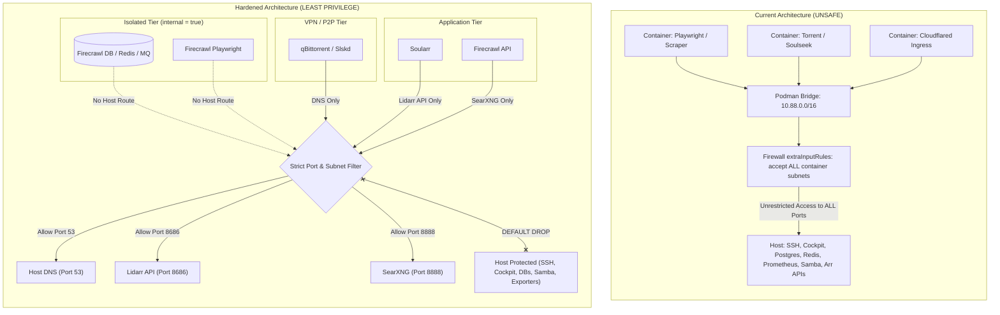

# Container-to-Host Network Isolation & Threat Hardening Plan

## Objective

Eliminate the dangerous blanket firewall rule `ip saddr { ${containerSourceSubnets} } accept comment "allow container subnets to host"` in [`hosts/yifuwuqi/networking/firewall.nix`](file:///home/yi/the.files/nixos/hosts/yifuwuqi/networking/firewall.nix). Replace it with a strict, **principle-of-least-privilege** container networking architecture that enforces container isolation, eliminates lateral movement pathways to host services, and guarantees that compromised containers cannot access host management interfaces, internal databases, or unauthenticated services.

---

## Current State & Risk Analysis

### Why "Allow Container Subnets to Host" is Unsafe

Currently in [`hosts/yifuwuqi/networking/firewall.nix`](file:///home/yi/the.files/nixos/hosts/yifuwuqi/networking/firewall.nix#L55-L61):

```nix
extraInputRules = ''
  # Allow yirukou reverse proxy and DNS resolver to access backend services
  ip saddr ${allAddresses.hosts.yirukou.network.lan.ipv4.host} accept comment "allow yirukou gateway"

  # Allow container subnets to reach host services (e.g. Lidarr API for soularr, MariaDB)
  ip saddr { ${containerSourceSubnets} } accept comment "allow container subnets to host"
'';
```

Where `${containerSourceSubnets}` expands to:
- `10.88.0.0/16` (default Podman bridge)
- `172.17.0.0/16` (Docker / Podman pool 1)
- `172.18.0.0/16` (Docker / Podman pool 2)

#### The Threat Vector

1. **Unconditional INPUT Chain Bypass**: In Linux netfilter, the `input` chain handles packets addressed to any local IP on the host (`10.42.0.2`, `10.88.0.1`, `100.69.0.2`, etc.). Accepting all packets with source in `containerSourceSubnets` grants **unrestricted, full-port access** to the host.
2. **Breach of Containment**: The purpose of containerization is isolation. Running a process in a container should limit its attack radius. With a blanket accept rule, every container running on the system can connect to:
   - **Administrative Interfaces**: SSH (`24212`), Cockpit web UI.
   - **Internal Databases & Caches**: Valkey/Redis (`6379`), PostgreSQL (`5432`).
   - **Application APIs**: Radarr (`7878`), Sonarr (`8989`), Lidarr (`8686`), Bazarr, Prowlarr.
   - **Monitoring & Telemetry**: Prometheus, Loki, Promtail, Grafana, Node Exporter, PostgreSQL Exporter (which leak internal configuration, endpoints, and environment info).
   - **Internal File Shares**: Samba (SMB), WebDAV, Atticd (Nix binary cache).
3. **High-Risk Container Attack Surfaces**:
   - **Web Scrapers & Browsers**: `firecrawl-playwright` renders arbitrary untrusted web content from the internet using headless Chromium. If an in-the-wild browser RCE/sandbox escape occurs, the attacker has instant network access to all host services.
   - **P2P Clients**: `qbittorrent` and `slskd` connect to thousands of untrusted internet peers.
   - **Third-Party Images**: Containers like `torrent-indexer`, `soularr`, and `flaresolverr` run community code directly from container registries.
   - **Public Ingress Tunnels**: `cloudflared`, `playit-agent`, and `localtonet` receive traffic from public internet edges.
4. **Bypasses Host Default-Deny**: Even if `eno1` (LAN) is configured with default-deny, containers on bridge interfaces bypass all interface-level port restrictions because the rule matches on source CIDR in the global input chain.

---

## Architectural Comparison: Blanket Accept vs Principle of Least Privilege



| Dimension | Current Architecture | Proposed Hardened Architecture |
| :--- | :--- | :--- |
| **Firewall Input Policy for Containers** | Blanket `accept` for all destination ports | Default **DROP**; explicit allow only for required ports (DNS, SearXNG, Lidarr) |
| **Internal Stack Networks** | Shared default bridge with host gateway | Podman custom network with `internal = true` (no gateway / no host route) |
| **Host Loopback Services** | Exposed to containers if bound to `0.0.0.0` or host LAN IP | Postgres & Valkey currently bind non-loopback IPs (`listen_addresses = "*"`, LAN IP) and must be gated by the firewall allowlist; AdGuard on internal IPs; SearXNG stays on `0.0.0.0` but only `53`, `8686`, `8888` are open to containers |
| **High-Risk Containers (Playwright)** | Can scan and exploit all host ports | Confined to internal network; cannot route to host IP |
| **Inter-Service Communication** | Plain TCP over shared bridge | UNIX domain sockets mounted directly, or isolated point-to-point ports |

---

## Decisions

### 1. Invert Container Firewall Policy to Default-Deny
- Remove `ip saddr { ${containerSourceSubnets} } accept comment "allow container subnets to host"` from [`hosts/yifuwuqi/networking/firewall.nix`](file:///home/yi/the.files/nixos/hosts/yifuwuqi/networking/firewall.nix).
- Replace with strict, explicit destination-port rules:
  1. **DNS Resolution**: Allow UDP/TCP port `53` from container subnets to host (for AdGuard Home / Aardvark DNS).
  2. **Explicit Host APIs (Soularr $\to$ Lidarr, Firecrawl $\to$ SearXNG)**: Allow TCP port `8686` (Lidarr) and TCP port `8888` (SearXNG) specifically, or migrate them to host-local reverse proxy / socket bindings. (Note: `8080` is qBittorrent's port — do not use it here.)
  3. **Drop Everything Else**: All other host ports (SSH `24212`, Cockpit `9090`, PostgreSQL `5432`, Valkey `6379`, Prometheus `9090`, Samba `445`, all Exporters) are dropped by default for container subnets.

### 2. Network Tiering & Podman Isolation
- **Tier 1: Internal Stacks (`internal = true`)**:
  - `firecrawl_net`: Isolate supporting containers (`firecrawl-redis`, `firecrawl-postgres`, `firecrawl-rabbitmq`, `firecrawl-playwright`) on an internal network without host default routing. Only the main `firecrawl` frontend bridges out if it needs SearXNG.
- **Tier 2: VPN / P2P Isolated Stack (`gluetun`)**:
  - `qbittorrent`, `slskd`, `flaresolverr`, `torrent-indexer` run isolated in the gluetun network namespace. They can only route outbound through VPN `tun0` and cannot connect to host management/database ports.
  - `soularr` only reaches Lidarr on host port `8686`.
- **Tier 3: Public Tunnels (`cloudflared`, `playit-agent`)**:
  - Confined so incoming tunnel traffic cannot pivot to private LAN or host daemon ports.

### 3. Localhost & Socket-Level Defense
- Loopback binding today is **inconsistent**, so this phase is a hardening target rather than an assumption:
  - **PostgreSQL**: binds `*` (all interfaces) because `enableTCPIP = true` (`modules/services/postgresql.nix:29`; nixpkgs sets `listen_addresses = "*"`), and port `5432` is open globally. It is reachable from containers today; only `pg_hba` trust rules (VPN CIDR + `127.0.0.1`) keep queries out, which is weak. The firewall allowlist must drop `5432` for container subnets, and ideally `listen_addresses` should be restricted to `127.0.0.1` + VPN IP.
  - **Valkey**: binds `addresses.services.valkey.host` (the LAN IP `10.42.0.2`) with `--protected-mode no` (`modules/services/valkey.nix`) — **NOT** loopback-bound; it is a real container-reachable host service and must be blocked by the firewall allowlist, not relied on for martian protection.
  - **AdGuard Home**: binds only internal IPs (`127.0.0.1`, `10.42.0.2`, Tailscale addresses) — unreachable from bridge subnets.
  - **SearXNG**: intentionally binds `0.0.0.0:8888` (`modules/services/searxng.nix`) because Firecrawl reaches it via `host.containers.internal` (the bridge gateway). It **cannot** be moved to loopback; its defense is the scoped `dport 8888` allowlist rule.
- Where a service can safely bind `127.0.0.1` or a UNIX socket (`/run/redis/redis.sock`, `/run/postgresql/.s.PGSQL.5432`), do so. Otherwise the firewall default-deny allowlist is the enforcement point — not the kernel martian filter.

---

## Phases & Implementation Strategy

### Phase 1: Audit Container Destination Requirements
Audit every active container on `yifuwuqi` to map its exact host communication requirements:

| Container Stack | Image | Host Ports Needed | Rationale |
| :--- | :--- | :--- | :--- |
| **Firecrawl Stack** | `firecrawl` | `8888` (SearXNG), `53` (DNS) | Queries local search engine and resolves web targets |
| **Firecrawl Backends** | `playwright`, `nuq-postgres`, `redis`, `rabbitmq` | **None** (Internal stack only) | Multi-container stack communication on `firecrawl_net` |
| **Soularr** | `soularr` | `8686` (Lidarr), `53` (DNS) | Pushes grab releases to Lidarr |
| **Gluetun / qBittorrent** | `gluetun`, `qbittorrent`, `slskd`, `flaresolverr` | `53` (DNS) | Outbound torrent traffic via VPN; no host services needed |
| **Portainer** | `portainer-ce` | UNIX socket `/run/podman/podman.sock` | Container management (no host TCP needed). Note: `portainer.nix` publishes `0.0.0.0:9443` on the host — blocked for containers by the new default-deny, but review the LAN/external exposure separately. |
| **Cloudflared / Playit** | `cloudflared`, `playit-agent` | `53` (DNS), designated reverse proxy ports | Outbound tunnel connections to edge |

### Phase 2: Refactor `firewall.nix` with Least-Privilege Rules

In [`hosts/yifuwuqi/networking/firewall.nix`](file:///home/yi/the.files/nixos/hosts/yifuwuqi/networking/firewall.nix):

```nix
extraInputRules = ''
  # Allow yirukou reverse proxy and DNS resolver to access backend services
  ip saddr ${allAddresses.hosts.yirukou.network.lan.ipv4.host} accept comment "allow yirukou gateway"

  # Container to Host: Principle of Least Privilege
  # 1. Allow containers to reach host DNS (Aardvark-DNS on the bridge gateway; AdGuard Home binds internal IPs only).
  #    Note: port 53 is already globally open via firecrawl.nix / the eno1 rules, so this rule is a precision
  #    tightening (scoped to container subnets), not the primary gate.
  ip saddr { ${containerSourceSubnets} } udp dport 53 accept comment "allow container dns udp"
  ip saddr { ${containerSourceSubnets} } tcp dport 53 accept comment "allow container dns tcp"

  # 2. Allow specific container integrations to required host APIs only
  ip saddr { ${containerSourceSubnets} } tcp dport {
    ${toString addresses.services.lidarr.port},
    ${toString addresses.services.searxng.port}
  } accept comment "allow containers to specific host apis"
'';
```

### Phase 3: Enforce Internal Podman Network Isolation for Multi-Container Stacks

In [`modules/services/firecrawl.nix`](file:///home/yi/the.files/nixos/modules/services/firecrawl.nix):
- Create internal network for backends: `podman network create --internal firecrawl_internal`
- Connect Redis, Postgres, RabbitMQ, and Playwright exclusively to `firecrawl_internal` so Playwright has zero route to the host or outside LAN.
- Connect `firecrawl` frontend to both `firecrawl_internal` and `firecrawl_net` (with internet access and SearXNG access).

### Phase 4: Verification & Integration Testing

1. **Verify Host Protection from Inside Container**:
   - Run a test container on the default bridge: `podman run --rm -it alpine nc -zv 10.42.0.2 24212` (SSH) $\to$ **Connection timed out / dropped**.
   - Test Cockpit port `9090`, PostgreSQL `5432`, Valkey `6379` from container $\to$ **Connection dropped**.
2. **Verify Legitimate Container Services**:
   - Test DNS resolution from container: `podman run --rm -it alpine nslookup github.com` $\to$ **Success**.
   - Test Soularr syncing with Lidarr API $\to$ **Success**.
   - Test Firecrawl running search query via SearXNG $\to$ **Success**.

---

## Rollout Order

1. **Step 1: Dry-run and Validate Port Matrix**: Verify exact port assignments for Lidarr (`8686`), SearXNG (`8888`), and DNS (`53`) in `addresses.nix`.
2. **Step 2: Update `firewall.nix`**: Replace the blanket accept rule with the restricted port allowlist.
3. **Step 3: Test Container Workflows**: Confirm Soularr, Firecrawl, qBittorrent, and Cloudflared operate without disruption.
4. **Step 4: Harden Podman Internal Networks**: Add `--internal` network isolation to Firecrawl backend services.

---

## Open Questions

1. **Soularr to Lidarr Communication**: Would you prefer keeping the firewall port allowlist for Lidarr (`8686`), or would you like to move Lidarr access behind a dedicated local Nginx reverse proxy endpoint or Unix socket?
2. **Firecrawl Playwright Isolation**: Should Playwright be completely air-gapped on an internal bridge with no internet egress (fetching pages via Firecrawl proxy), or does it need direct outbound internet access for rendering external web assets?
3. **Portainer Socket Exposure**: Portainer currently mounts `/run/podman/podman.sock` with `--privileged`. Would you like to review rootless Podman socket isolation or Cockpit-podman as a lighter alternative?
