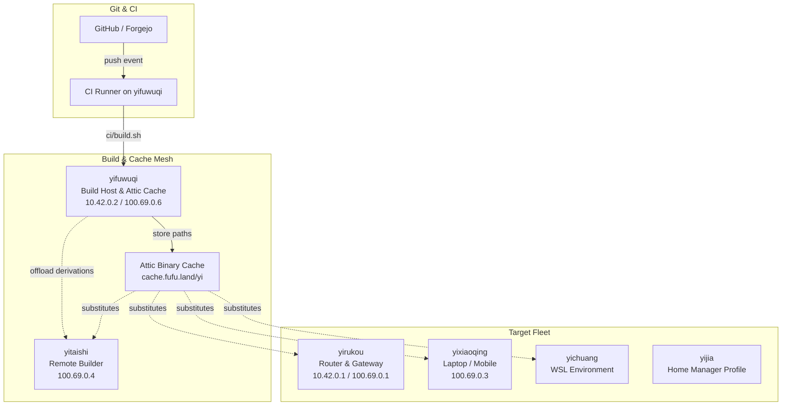
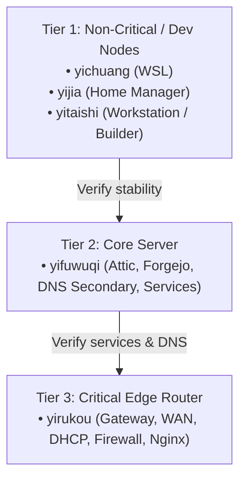

# NixOS Build Deployment Strategy & Architecture Plan

## Objective

Design and implement a unified, robust, and safe strategy to deploy new NixOS system builds and Home Manager closures to all hosts across the mesh (`yifuwuqi`, `yirukou`, `yitaishi`, `yixiaoqing`, `yichuang`), leveraging existing distributed builds and the Attic binary cache (`cache.fufu.land/yi`).

**Every deploy is manual, one host at a time, via a Forgejo Actions "deploy button" that shows the diff before anything is applied.**

---

## Current State

1. **Build & Cache Infrastructure**:
   - `ci/build.sh` on `yifuwuqi` builds all `nixosConfigurations.<host>.config.system.build.toplevel` closures and offloads heavy derivations to `yitaishi` when reachable.
   - Attic binary cache (`cache.fufu.land/yi`) stores pre-built derivations.
   - Every host includes `cache.fufu.land/yi` in `nix.settings.substituters` via `modules/services/attic/client.nix`.
2. **CI (build only, never deploy)**:
   - `.forgejo/workflows/flake-ci.yml` already declares `workflow_dispatch:`. It builds every host closure and pushes them to Attic on push/PR/manual run.
   - There is **no deploy step anywhere** — deploying is still done by hand (`nixos-rebuild switch --build-host ... --target-host ...`, `nh os switch -H ...`).
3. **Current Deployment Friction**:
   - No unified tool for deploying both NixOS system closures and standalone Home Manager profiles (`yijia`).
   - No rollback or connection verification (risk of network blackout on `yirukou`).
   - No way to preview what a deploy will change before it happens.

---

## Decisions

### 1. Manual Deploys Only, One Host At A Time
- CI builds closures and pushes them to Attic — **it never deploys**.
- Every deploy is triggered by hand, targeting exactly **one host per run** (`yixiaoqing`, `yitaishi`, `yifuwuqi`, `yirukou`, `yichuang`, or `yijia`).
- No `deploy all`, no matrix deployment, no auto-pull agent. Deploying the fleet together risks compounding failures; a single host keeps blast radius to one machine and lets each host be verified before the next.

### 2. Deploy Button = Forgejo Actions `workflow_dispatch`
- A new `.forgejo/workflows/deploy.yml` renders a "Run workflow" button in the Forgejo UI with two inputs:
  - `host` — `choice`: `yixiaoqing` | `yitaishi` | `yifuwuqi` | `yirukou` | `yichuang` | `yijia`
  - `mode` — `choice`: `diff` | `deploy`
- `concurrency.group: deploy-${{ inputs.host }}` ensures a host can never be double-deployed by two overlapping runs.

### 3. Diff Mode: See Everything Before Deploying
- `mode: diff` builds the target closure, fetches the host's current generation, and prints into the **workflow run log** (Forgejo renders ANSI/color):
  - Package changes via `nvd diff` between the host's current system profile and the new closure (added / removed / upgraded / downgraded).
  - Systemd unit restart summary via deploy-rs `--dry-activate` (or `nixos-rebuild --target-host ... --dry-run`).
  - Store size delta / what will be substituted from Attic.
- Diff mode **never deploys**. It exits after printing the plan.

### 4. Deploy Mode: Deploy-rs With Magic Rollback
- `mode: deploy` runs deploy-rs for the single selected host:
  - **Magic Rollback**: if an update breaks networking/firewall/SSH on `yirukou` (router) or `yifuwuqi` (server), the target automatically reverts to the previous working generation within the `confirmTimeout`.
  - **Multi-Profile Support**: `yijia` deploys as a standalone Home Manager profile; every NixOS host as a `system` profile — selected via the same single-host flow.
  - **Zero Remote Daemon**: requires only standard SSH access and Nix store transfer.
- Deploy mode also runs a connectivity/SSH verification before and after activation.

### 5. Tiered Rollout Strategy (Operator Discipline, Blast Radius Containment)
Deployment order is manual but enforced by convention, one host at a time:

- **Tier 1 (Dev & Workstations)**: `yichuang`, `yitaishi`, `yijia` — first to receive changes.
- **Tier 2 (Core Server)**: `yifuwuqi` — must remain up to serve the binary cache to other hosts.
- **Tier 3 (Perimeter / Gateway)**: `yirukou` — always deployed last; protected with Deploy-rs Magic Rollback.

---

## Phases

### Phase 1: Flake Integration & Deploy-rs Schema
- Add `deploy-rs` to `flake.nix` inputs.
- Define `deploy.nodes` schema mapping all hosts (`yifuwuqi`, `yirukou`, `yitaishi`, `yixiaoqing`, `yichuang`) with a `system` profile, plus a standalone `yijia` Home Manager profile.
- Tag each node with a `groups` entry reflecting its tier (`tier1`, `tier2`, `tier3`) for optional group filtering.
- Configure timeouts, `autoRollback`, and `magicRollback` (keep magic rollback enabled for `yirukou` and `yifuwuqi`).

### Phase 2: Forgejo Deploy Workflow (The Button)
- Create `.forgejo/workflows/deploy.yml` with `workflow_dispatch` inputs (`host` choice, `mode` choice) and per-host `concurrency.group`.
- `mode: diff` job runs the diff script and prints results into the run log.
- `mode: deploy` job runs the deploy script against the single selected host.

### Phase 3: Deploy / Diff Runner Script
- Create `ci/deploy.sh` with two modes:
  - `diff <host>`: build closure → read remote current profile → `nvd diff` → dry-activate unit summary → store size estimate → print, then stop.
  - `deploy <host>`: run deploy-rs for that one host with rollback, plus SSH connectivity check before/after.
- Add a devshell `deploy` helper (mirroring the same flow) for terminal use.

### Phase 4: Validation & Canary Rollouts
- Run `mode: diff` for every host and verify the printed plan.
- Perform live canary `mode: deploy` on `yitaishi` and `yichuang`.
- Deploy to `yifuwuqi` and verify service health.
- Perform safe deployment to `yirukou` with active ping verification and magic rollback armed.

---

## Rollout Order

1. **`yitaishi` / `yichuang` / `yijia` (Tier 1)**: Dev & Workstation nodes — diff, verify, deploy one at a time.
2. **`yifuwuqi` (Tier 2)**: Core services & Attic binary cache.
3. **`yirukou` (Tier 3)**: Critical edge router & firewall (supervised with magic rollback).

---

## Open Questions

1. **SSH Authentication Lane**: Direct `root` SSH keys (client-root $\to$ server-root) vs `yi` unprivileged user with passwordless sudo for activation? (Lean: `yi` + passwordless sudo, matching the existing `--target-host yi@... --use-remote-sudo` pattern.)
2. **Deploy Gate Shape**: Forgejo has no GitHub-style approval environments. Keep the two-click flow (`mode: diff` → review log → `mode: deploy`) as the sole gate, or add an interactive confirm inside deploy mode too?
