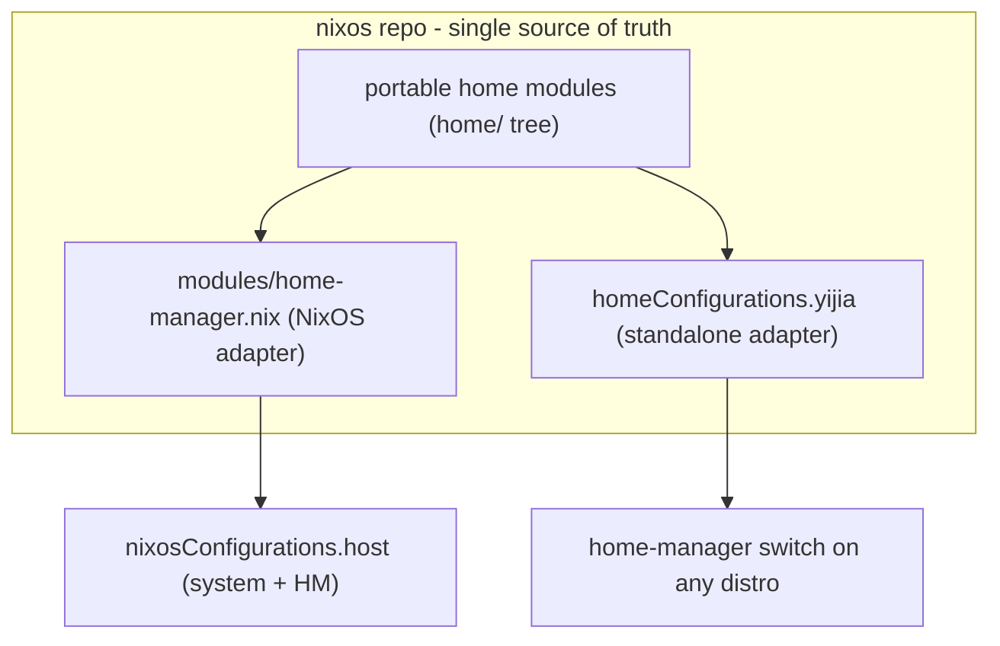

# Portable Home Manager (nixos repo as source of truth)

Make the `nixos` flake the single source of truth for the home config and expose it two ways: the existing `nixosConfigurations.<host>` (system + HM, unchanged) and a portable `homeConfigurations.yijia` that builds under standalone `home-manager` on any Linux distro. Ownership is inverted into `nixos`: `the.files` stops handling dotfiles and drops to an umbrella checkout. All real HM logic already lives under [`users/`](../../../users); the only outward coupling is a handful of raw-dotfile reads from the `thefiles` flake input, which this plan removes.

## Decisions

- The `nixos` repo owns everything: user-level AND host-level. One flake, one `flake.lock`, no second flake and no submodule pin to track.
- The `thefiles` flake input is removed. The raw dotfiles it provided move into the `nixos` repo and become relative reads of git-tracked files.
- One portable home module set feeds two adapters: the NixOS adapter ([`modules/home-manager.nix`](../../../modules/home-manager.nix) `mkHome`, behavior unchanged) and a new standalone adapter (`homeConfigurations.yijia`).
- Host facts (monitors, desktop env/shell, keyboard profile, hostname, gnome extension UUIDs) flow into the portable modules as module options / args with off-NixOS-safe defaults. NixOS sets them from host config; the standalone profile sets them inline.
- No secrets move and none are read at eval. Because both adapters live in the same repo, the pure data helpers ([`secrets/keys.nix`](../../../secrets/keys.nix), [`modules/addresses.nix`](../../../modules/addresses.nix), [`modules/ssh-dynamic.nix`](../../../modules/ssh-dynamic.nix)) stay reachable and evaluate anywhere; only `osConfig` genuinely needs NixOS.
- `the.files` becomes a non-flake umbrella checkout (the `nixos` submodule + `.emacs.d`/`mc-fufuland`/`scm_breeze` + loose scripts). Its in-progress flake draft is reverted.

## Architecture



## 1. Workstream A - decouple from the.files (mechanical, zero behavior change)

The entire coupling surface is raw-dotfile reads via `inputs.thefiles`. Move each asset into the repo and repoint the reader to a relative path. Flakes only see git-tracked files, so each moved asset must be `git add`ed.

- `.gitconfig` -> [`users/programs/git.nix`](../../../users/programs/git.nix) (`[include] path = ${inputs.thefiles}/.gitconfig`).
- `.ssh/config` -> [`users/programs/ssh/default.nix`](../../../users/programs/ssh/default.nix) and [`modules/services/openssh.nix`](../../../modules/services/openssh.nix) (`readFile "${inputs.thefiles}/.ssh/config"`).
- `.config/starship.toml` -> [`users/programs/tui.nix`](../../../users/programs/tui.nix) (`readFile "${inputs.thefiles}/.config/starship.toml"`).
- `.config/niri/` -> [`users/programs/niri.nix`](../../../users/programs/niri.nix) (`cp -r ${inputs.thefiles}/.config/niri`).
- `.zshrc` -> [`users/home/common.nix`](../../../users/home/common.nix) (`readFile "${inputs.thefiles}/.zshrc"`).
- `.config/zsh/` -> replace the `inputs.thefiles.homeModules.default` import in [`users/home/common.nix`](../../../users/home/common.nix) with an in-repo module that symlinks `.config/zsh` (the only asset `homeModules.default` uniquely provided; it also re-symlinked starship/niri, now handled by their own modules).

Then sever the input:

- Remove the `thefiles` input from [`flake.nix`](../../../flake.nix) and its `flake.lock` entry.
- Drop `--override-input thefiles ...` from [`nix/devshell.nix`](../../../nix/devshell.nix) (the `nixos-rebuild` wrapper) and [`ci/build.sh`](../../../ci/build.sh).

After A, `nixos` builds with no external dotfile dependency and NixOS behavior is unchanged.

## 2. Workstream B - add the standalone `homeConfigurations.yijia`

Key property: staying in one repo removes the dominant "eval breaks off-NixOS" risk. [`secrets/keys.nix`](../../../secrets/keys.nix), [`modules/addresses.nix`](../../../modules/addresses.nix), and [`modules/ssh-dynamic.nix`](../../../modules/ssh-dynamic.nix) are pure data/functions and remain in-repo, so they evaluate on any distro - they only embed host-specific values. The single thing that genuinely requires a NixOS system at eval is `osConfig`.

Eval blockers and work:

- Hard blocker: [`users/programs/niri.nix`](../../../users/programs/niri.nix) takes a required `osConfig` arg and reads `osConfig.desktop.shell` + `osConfig.desktop.monitors`. Standalone HM does not supply `osConfig`. Refactor to receive `monitors`/`shell` as options/args defaulting to `[]`/`"none"`.
- niri stays a raw-KDL relocation: config is the moved `.config/niri/` plus the existing Nix-string `include` files (`generatedBinds`, `outputsKdl`). `niri-flake` is NOT required - system enablement is nixpkgs' `programs.niri.enable` in [`modules/desktop/niri.nix`](../../../modules/desktop/niri.nix). HM only writes config, never installs the niri binary; on non-NixOS the compositor comes from the host distro.
- Defer gnome: [`modules/desktop/gnome-home.nix`](../../../modules/desktop/gnome-home.nix) has heavy `osConfig` use but is only pulled NixOS-side via [`modules/desktop/gnome.nix`](../../../modules/desktop/gnome.nix) (`home-manager.sharedModules`). Exclude it from the generic profile; its options-port is a later phase.
- Non-blockers (eval fine, only embed host-specific values; optionize later, default `null`): the git signing key in [`users/programs/git.nix`](../../../users/programs/git.nix), the dynamic ssh rewrites in [`users/programs/ssh/default.nix`](../../../users/programs/ssh/default.nix), and the literal `{file:/run/secrets/tokens/deepseek}` in [`users/programs/opencode.nix`](../../../users/programs/opencode.nix) (resolved by opencode at runtime, not at Nix eval).

Output wiring ([`flake.nix`](../../../flake.nix) is flake-parts; add a flat output under `flake = { ... }` next to `nixosConfigurations`):

```nix
flake.homeConfigurations.yijia = inputs.home-manager.lib.homeManagerConfiguration {
  pkgs = import inputs.nixpkgs {
    system = "x86_64-linux";
    config.allowUnfree = true;
  };
  extraSpecialArgs = {
    inherit inputs;
    desktopEnvironment = "niri";
    desktopShell = "dms";
    # monitors etc. via the new options
  };
  modules = [
    ./users/home/yi.nix
    { home.stateVersion = "26.05"; }
  ];
};
```

The NixOS-only inputs (`sops-nix`, `lanzaboote`, `musnix`, `nixos-wsl`) are fetched into the lock but never built by the home closure, so the generic profile stays lean.

## 3. Suggested layout

To actually isolate HM, carve a dedicated portable tree (e.g. `home/`) holding the modules currently under [`users/programs/`](../../../users/programs), the per-user profiles, the moved dotfile assets, and a small options module (the `<ns>.desktop.{environment,shell,monitors,keyboardProfile,hostName}` declarations). Both adapters import the same tree:

- NixOS adapter: [`modules/home-manager.nix`](../../../modules/home-manager.nix) `mkHome` stays as is but sets the new options from host facts. It already threads `desktopEnvironment`/`desktopShell`/`keyboardProfile` through `extraSpecialArgs`.
- Standalone adapter: `homeConfigurations.yijia` imports the same profile and sets the same options inline.

This is a module/adapter split inside one repo - no submodule pin drift, no two-pin promote dance, no `--override-input` dev loop.

## 4. the.files after the port

- `the.files` keeps being the umbrella checkout: the `nixos` submodule plus `.emacs.d`/`mc-fufuland`/`scm_breeze` and the loose scripts. It no longer ships dotfiles or a flake.
- Revert/remove the in-progress `the.files/flake.nix` draft (it references a non-existent `home/` tree and will not evaluate) and its now-obsolete `homeModules.default` symlink module.

## 5. Validation

- Standalone: `nix build .#homeConfigurations.yijia.activationPackage` (and `home-manager switch --flake .#yijia` on a non-NixOS box).
- Per host: `nixos-rebuild build --flake .#<host>` (no more `--override-input thefiles`).
- CI guard: expose the portable profile as `checks.yijia` (built by `nix flake check`) so an accidental `osConfig`/secret read can never silently break the portable path.

## 6. Bootstrap

Consume (flakes fetch everything; no clone needed):

```bash
nixos-rebuild switch --flake github:categoricalcat/nixos#<host>      # NixOS host
home-manager switch --flake github:categoricalcat/nixos#yijia   # any distro
```

Develop (edit + test before push): clone `nixos` directly and build with `--flake .#<host>` / `--flake .#yijia`. No submodule init, no `--override-input`.

Imperative per-host steps no flake refactor removes (see [`README.md`](../../../README.md) and [`docs/src/services/secrets.md`](../services/secrets.md)):

- sops age host key + `passwords/*` secrets (otherwise `users.nix` `hashedPasswordFile` / `sops.secrets` fail).
- FIDO2 `u2f_keys`; on `yitaishi`, Secure Boot / lanzaboote key enrollment.
- The `etc/nixos -> ~/the.files/nixos` symlink ([`users/users.nix`](../../../users/users.nix)) is a dev convenience, not a build requirement.

## 7. Phasing (low risk first)

1. Workstream A: move dotfile assets in-repo, repoint reads, drop the `thefiles` input. Zero behavior change.
2. Refactor [`users/programs/niri.nix`](../../../users/programs/niri.nix) off `osConfig`; carve the `home/` options module.
3. Add `homeConfigurations.yijia` + the CI eval guard.
4. Optionize the host-fact leaks (git signing, ssh dynamic, opencode token) for a clean standalone profile.
5. Optional follow-ups (out of scope here): `niri-flake` typed `programs.niri.settings`; HM-installed `pkgs.niri` for fully standalone niri on non-NixOS; port [`modules/desktop/gnome-home.nix`](../../../modules/desktop/gnome-home.nix) options for a gnome generic profile.

## 8. Non-goals and risks

- Non-goals: relocating secrets into the repo; changing host runtime behavior; deploying; removing NixOS-only enablement; adopting `niri-flake` or installing the niri binary via HM (the standalone profile writes config only; the compositor comes from the host distro).
- Risks:
  - Portability discipline must hold across every module in `home/` - one `osConfig`/secret read breaks `#yijia`. The CI build of the generic profile is the guard.
  - Non-NixOS users fetch the full `nixos` lock (source only; nothing NixOS-only is built).
  - Self-referential `${inputs.thefiles}/...` reads must convert to relative reads of git-tracked files.
  - Host-specific values (git signing key, ssh rewrites) leak into standalone output until optionized.
