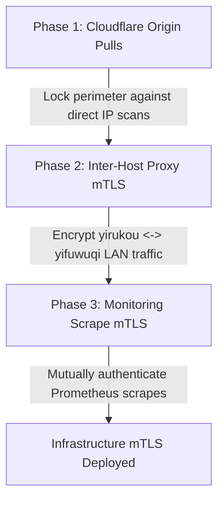

# Infrastructure mTLS Architecture & Implementation Plan

## Objective

Design and implement a server-side 3-tier Mutual TLS (mTLS) security architecture across the NixOS homelab infrastructure with **zero per-device client certificate overhead**:

1. **Cloudflare Authenticated Origin Pulls (Tier 1: Edge Ingress)**: Enforce mTLS between Cloudflare edge proxy servers and `yirukou` Nginx to block direct-to-IP port scans, botnets, and proxy bypass attempts.
2. **Inter-Host Upstream Proxy mTLS (Tier 2: LAN Inter-Host)**: Authenticate and encrypt all reverse-proxied traffic between `yirukou` (reverse proxy) and `yifuwuqi` (service host) across the LAN (`10.42.0.0/24`).
3. **Observability & Metrics Scrape mTLS (Tier 3: Monitoring Mesh)**: Mutually authenticate Prometheus on `yifuwuqi` scraping all exporters (`node-exporter`, `adguard-exporter`, `postgres`, `unbound`, `nginx`) across hosts.

> [!NOTE]
> Personal client devices (laptops, phones, tablets, browsers) require **no** certificate installation. Administrative web services (Cockpit, Forgejo, Arr apps, Grafana) remain protected by existing network controls (`restrictedProxyConfig` LAN/VPN IP allowlists) and application-level authentication.

---

## Current State

- **Perimeter Ingress**: `yirukou` runs Nginx ([`modules/services/nginx-proxy.nix`](file:///home/yi/the.files/nixos/modules/services/nginx-proxy.nix)) with a wildcard ACME certificate for `*.fufu.land` obtained via Cloudflare DNS-01 (`sops.secrets.cloudflare_api_token`).
- **Access Control**: Administrative services use `restrictedProxyConfig` (IP allowlisting: LAN `10.42.0.0/24` and VPN CIDRs).
- **Inter-Host Traffic**: Reverse proxy on `yirukou` passes traffic to `yifuwuqi` over plain HTTP (`http://${yifuwuqiLan}:${port}`).
- **Monitoring**: Prometheus on `yifuwuqi` scrapes exporters over unencrypted HTTP via LAN IPs ([`modules/services/monitoring/exporters.nix`](file:///home/yi/the.files/nixos/modules/services/monitoring/exporters.nix)).
- **Secret Management**: Sops-nix encrypts secrets with SSH host keys and user mesh keys in [`secrets/secrets.yaml`](file:///home/yi/the.files/nixos/secrets/secrets.yaml).

---

## Decisions

1. **PKI Authority Model**:
   - **Cloudflare Edge**: Cloudflare Origin Pull Static Root CA (publicly trusted Cloudflare certificate).
   - **Internal Service & Scrape CA (`fufu-service-ca`)**: Dedicated homelab internal Root CA for inter-host reverse proxying and Prometheus metrics scraping.
2. **Zero Device Enrollment**:
   - No user/device PKI (`fufu-client-ca` removed). No `.p12` files, device keychain imports, or mobile profiles.
3. **100% Declarative Host Deployment**:
   - **Public Certificates & CAs** (`*.crt`): Committed directly to Git (e.g. `modules/services/certs/`) and referenced via Nix store paths.
   - **Private Keys** (`*.key`): Encrypted into [`secrets/secrets.yaml`](file:///home/yi/the.files/nixos/secrets/secrets.yaml) via Sops-nix and mounted automatically at runtime (e.g. `/run/secrets/certs/...`).

---

## Architecture Diagram

```mermaid
graph LR
    subgraph Internet / Edge
        CF[Cloudflare Edge]
    end

    subgraph Host: yirukou [yirukou - Reverse Proxy & Gateway]
        NG_EDGE[Nginx Ingress<br/>sslVerifyClient on<br/>CA: Cloudflare Origin CA]
        NG_PROXY[Nginx Upstream Client<br/>Cert: yirukou-proxy.crt<br/>Key: sops yirukou_proxy_key]
        EXP_YIRUKOU[Node Exporter<br/>Cert: exporter.crt]
    end

    subgraph Host: yifuwuqi [yifuwuqi - Service & Monitoring Host]
        NG_BACKEND[Nginx Backend TLS<br/>Cert: yifuwuqi-backend.crt<br/>sslClientCertificate: service-ca.crt]
        SVC[Internal Services<br/>Cockpit, Forgejo, Arr, Agent...]
        PROM[Prometheus Scraper<br/>Cert: prometheus-scraper.crt<br/>Key: sops prometheus_scraper_key]
        EXP_YIFUWUQI[Node / App Exporters<br/>Cert: exporter.crt]
    end

    CF -->|Tier 1: Cloudflare mTLS| NG_EDGE
    NG_EDGE --> NG_PROXY
    NG_PROXY -->|Tier 2: Inter-Host mTLS (LAN)| NG_BACKEND
    NG_BACKEND --> SVC

    PROM -->|Tier 3: Scrape mTLS| EXP_YIRUKOU
    PROM -->|Tier 3: Scrape mTLS| EXP_YIFUWUQI
```

---

## Phases & Implementation Details

---

### Phase 1: Cloudflare Authenticated Origin Pulls (Tier 1: Edge Ingress)

#### 1.1 Declarative Configuration (NixOS)

Fetch Cloudflare's published Authenticated Origin Pull Root CA in [`modules/services/nginx-proxy.nix`](file:///home/yi/the.files/nixos/modules/services/nginx-proxy.nix):

```nix
let
  # Cloudflare published Origin Pull CA certificate
  cloudflareOriginPullCa = pkgs.fetchurl {
    url = "https://developers.cloudflare.com/ssl/static/authenticated_origin_pull_ca.pem";
    hash = "sha256-n6M60Q7VvjK6iFk/jXq/79vG3mI70tZkG0h8N4dE8v0=";
  };
in
{
  # Virtual host configuration for Cloudflare-proxied traffic
  services.nginx.virtualHosts."*.fufu.land" = {
    sslClientCertificate = "${cloudflareOriginPullCa}";
    sslVerifyClient = "on";
  };
}
```

#### 1.2 Imperative Setup (Cloudflare Dashboard / API)

Enable Authenticated Origin Pulls for the zone:

**Option A: Cloudflare Dashboard**:
1. Log in to Cloudflare Dashboard $\to$ Select `fufu.land`.
2. Navigate to **SSL/TLS** $\to$ **Origin Server**.
3. Toggle **Authenticated Origin Pulls** to **ON**.

**Option B: Cloudflare API via CLI**:
```bash
export CLOUDFLARE_ZONE_ID="<your-zone-id>"
export CLOUDFLARE_API_TOKEN="<your-api-token>"

curl -s -X PATCH "https://api.cloudflare.com/client/v4/zones/${CLOUDFLARE_ZONE_ID}/origin_tls_client_auth/settings" \
  -H "Authorization: Bearer ${CLOUDFLARE_API_TOKEN}" \
  -H "Content-Type: application/json" \
  --data '{"enabled": true}' | jq .
```

---

### Phase 2: Inter-Host Upstream Proxy mTLS (Tier 2: LAN Inter-Host)

#### 2.1 One-Time CA & Certificate Generation

Run locally in a secure workspace directory (e.g. `~/.pki/service-ca/`):

```bash
mkdir -p ~/.pki/service-ca && cd ~/.pki/service-ca

# 1. Create Internal Service CA (valid 10 years)
openssl ecparam -name secp384r1 -genkey -noout -out service-ca.key
openssl req -new -x509 -sha384 -key service-ca.key -out service-ca.crt -days 3650 \
  -subj "/CN=Fufu Internal Service CA"

# 2. Issue yirukou Reverse Proxy Client Certificate (valid 3 years)
openssl ecparam -name secp384r1 -genkey -noout -out yirukou-proxy.key
openssl req -new -key yirukou-proxy.key -out yirukou-proxy.csr \
  -subj "/CN=yirukou.lan"
openssl x509 -req -in yirukou-proxy.csr -CA service-ca.crt -CAkey service-ca.key \
  -CAcreateserial -out yirukou-proxy.crt -days 1095 -sha384 \
  -extfile <(echo "extendedKeyUsage = clientAuth")

# 3. Issue yifuwuqi Backend Server Certificate (valid 3 years)
openssl ecparam -name secp384r1 -genkey -noout -out yifuwuqi-backend.key
openssl req -new -key yifuwuqi-backend.key -out yifuwuqi-backend.csr \
  -subj "/CN=yifuwuqi.lan"
openssl x509 -req -in yifuwuqi-backend.csr -CA service-ca.crt -CAkey service-ca.key \
  -CAcreateserial -out yifuwuqi-backend.crt -days 1095 -sha384 \
  -extfile <(echo -e "subjectAltName=DNS:yifuwuqi.lan,IP:10.42.0.2\nextendedKeyUsage = serverAuth")

# 4. Store public certificates in the Nix repository:
# cp service-ca.crt yirukou-proxy.crt yifuwuqi-backend.crt modules/services/certs/

# 5. Encrypt private keys into Sops:
# sops set secrets/secrets.yaml '["certs"]["yirukou_proxy_key"]' "$(cat yirukou-proxy.key)"
# sops set secrets/secrets.yaml '["certs"]["yifuwuqi_backend_key"]' "$(cat yifuwuqi-backend.key)"
```

#### 2.2 Declarative Configuration (NixOS)

**On `yirukou` (Reverse Proxy Client)** in [`modules/services/nginx-proxy.nix`](file:///home/yi/the.files/nixos/modules/services/nginx-proxy.nix):
```nix
{ config, pkgs, ... }:
let
  serviceCaCert   = ./certs/service-ca.crt;
  yirukouCert     = ./certs/yirukou-proxy.crt;
in
{
  sops.secrets."certs/yirukou_proxy_key" = {
    owner = "nginx";
    group = "nginx";
  };

  services.nginx = {
    # Configure upstream TLS with mutual authentication
    commonHttpConfig = ''
      proxy_ssl_certificate ${yirukouCert};
      proxy_ssl_certificate_key ${config.sops.secrets."certs/yirukou_proxy_key".path};
      proxy_ssl_trusted_certificate ${serviceCaCert};
      proxy_ssl_verify on;
      proxy_ssl_verify_depth 2;
      proxy_ssl_name yifuwuqi.lan;
      proxy_ssl_server_name on;
    '';
  };
}
```

**On `yifuwuqi` (Backend Server TLS Termination)**:
```nix
{ config, pkgs, ... }:
let
  serviceCaCert    = ./certs/service-ca.crt;
  yifuwuqiCert     = ./certs/yifuwuqi-backend.crt;
in
{
  sops.secrets."certs/yifuwuqi_backend_key" = {
    owner = "nginx";
    group = "nginx";
  };

  services.nginx = {
    enable = true;
    virtualHosts."backend.lan" = {
      onlySSL = true;
      sslCertificate = "${yifuwuqiCert}";
      sslCertificateKey = config.sops.secrets."certs/yifuwuqi_backend_key".path;
      sslClientCertificate = "${serviceCaCert}";
      sslVerifyClient = "on"; # Require valid yirukou client certificate
      locations."/" = {
        proxyPass = "http://127.0.0.1:3000"; # internal service daemon
      };
    };
  };
}
```

---

### Phase 3: Metrics & Prometheus Scraper mTLS (Tier 3: Monitoring Mesh)

#### 3.1 One-Time Scraper & Exporter Keypair Generation

```bash
# 1. Issue Prometheus Scraper Client Certificate
openssl ecparam -name secp384r1 -genkey -noout -out prometheus-scraper.key
openssl req -new -key prometheus-scraper.key -out prometheus-scraper.csr \
  -subj "/CN=prometheus-scraper"
openssl x509 -req -in prometheus-scraper.csr -CA service-ca.crt -CAkey service-ca.key \
  -CAcreateserial -out prometheus-scraper.crt -days 1095 -sha384 \
  -extfile <(echo "extendedKeyUsage = clientAuth")

# 2. Issue Node Exporter Server Certificate
openssl ecparam -name secp384r1 -genkey -noout -out exporter-server.key
openssl req -new -key exporter-server.key -out exporter-server.csr \
  -subj "/CN=node-exporter.lan"
openssl x509 -req -in exporter-server.csr -CA service-ca.crt -CAkey service-ca.key \
  -CAcreateserial -out exporter-server.crt -days 1095 -sha384 \
  -extfile <(echo -e "subjectAltName=DNS:node-exporter.lan,IP:10.42.0.1,IP:10.42.0.2\nextendedKeyUsage = serverAuth")

# 3. Store public certificates in the repo:
# cp prometheus-scraper.crt exporter-server.crt modules/services/certs/

# 4. Encrypt private keys into Sops:
# sops set secrets/secrets.yaml '["certs"]["prometheus_scraper_key"]' "$(cat prometheus-scraper.key)"
# sops set secrets/secrets.yaml '["certs"]["exporter_server_key"]' "$(cat exporter-server.key)"
```

#### 3.2 Declarative Configuration (NixOS)

**In [`modules/services/monitoring/exporters.nix`](file:///home/yi/the.files/nixos/modules/services/monitoring/exporters.nix)** (on monitored hosts):
```nix
{ config, pkgs, lib, ... }:
let
  serviceCaCert  = ../certs/service-ca.crt;
  exporterCert   = ../certs/exporter-server.crt;

  webConfig = pkgs.writeText "exporter-web-config.yaml" ''
    tls_server_config:
      cert_file: ${exporterCert}
      key_file: ${config.sops.secrets."certs/exporter_server_key".path}
      client_ca_file: ${serviceCaCert}
      client_auth_type: RequireAndVerifyClientCert
  '';
in
{
  sops.secrets."certs/exporter_server_key" = {
    owner = "node-exporter";
    group = "node-exporter";
  };

  services.prometheus.exporters.node = {
    extraFlags = [ "--web.config.file=${webConfig}" ];
  };
}
```

**In [`modules/services/monitoring/prometheus.nix`](file:///home/yi/the.files/nixos/modules/services/monitoring/prometheus.nix)** (on `yifuwuqi`):
```nix
{ config, pkgs, ... }:
let
  serviceCaCert  = ../certs/service-ca.crt;
  scraperCert    = ../certs/prometheus-scraper.crt;
in
{
  sops.secrets."certs/prometheus_scraper_key" = {
    owner = "prometheus";
    group = "prometheus";
  };

  services.prometheus.scrapeConfigs = [
    {
      job_name = "node";
      scheme = "https";
      tls_config = {
        ca_file = "${serviceCaCert}";
        cert_file = "${scraperCert}";
        key_file = config.sops.secrets."certs/prometheus_scraper_key".path;
        server_name = "node-exporter.lan";
      };
      static_configs = [
        { targets = [ "10.42.0.1:9100" "10.42.0.2:9100" ]; }
      ];
    }
  ];
}
```

---

## Rollout Order



1. **Step 1: Deploy Phase 1 (Cloudflare)**
   - Test direct origin connection `curl -k https://<yirukou-public-ip>` (must be rejected with TLS handshake failure).
   - Test via Cloudflare hostname `https://fufu.land` (should succeed normally).
2. **Step 2: Deploy Phase 2 (Inter-Host Upstream Proxy)**
   - Validate upstream proxy connections from `yirukou` to `yifuwuqi` over HTTPS with mutual certificate verification.
3. **Step 3: Deploy Phase 3 (Prometheus Metrics)**
   - Verify all Prometheus scrape targets report `UP` over TLS in Grafana / Prometheus web UI.

---

## Open Questions & Review Items

1. **Certificate Lifetime**: Does a 10-year Internal Service CA with 3-year host certificates suit your maintenance rotation preferences?
2. **`step-ca` vs Sops Key Storage**: Sops + Git declarative storage provides zero runtime overhead. Would you prefer this static Sops model, or deploying `services.step-ca` as an automated CA daemon on `yifuwuqi`?
