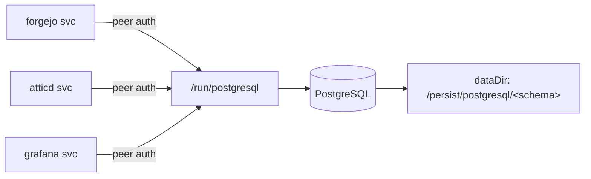

# Centralize Service Databases on PostgreSQL (yifuwuqi)

Replace per-service SQLite/MariaDB with one PostgreSQL instance on `yifuwuqi`, connected via the local Unix socket `/run/postgresql` using peer auth (system user == DB role == DB name, `ensureDBOwnership`). No passwords, no TCP for now. Only the active SQL services migrate; non-relational stores (Redis, time-series, MongoDB) are inventoried below but stay local.

## Decisions (confirmed)

- **Scope**: document *every* service that uses any database (see inventory below), but only migrate the **active SQL** services (Forgejo, Atticd, Grafana) onto the central Postgres. Disabled/unused services and non-relational stores are documented, not migrated.
- **Forgejo**: start fresh on empty Postgres (re-bootstrap). The pgloader data-migration path is documented as an alternative, not the default.
- **Container access**: deferred. Unix-socket peer auth only (no `enableTCPIP`, no `pg_hba` password rules, no firewall changes).
- **Nextcloud**: disabled (import commented), so left untouched -- no config change now. The `pgsql` target is documented for when it is re-enabled.
- **Persistence**: DB data lives under `/persist` per repo convention.

## Database inventory

Every service on `yifuwuqi` that touches any database, with its current backend and disposition. Only the active SQL services migrate to the central Postgres.

| Service | Module / import | State | Backend (now) | Disposition |
| --- | --- | --- | --- | --- |
| Forgejo | `modules/services/forgejo.nix` | enabled | SQLite (`database.type = "sqlite3"`) | Migrate -> central Postgres |
| Atticd | `modules/services/atticd.nix` | enabled | SQLite (`/var/lib/atticd/server.db`, module default) | Migrate -> central Postgres |
| Grafana | `modules/services/monitoring/grafana.nix` | enabled | SQLite (`/var/lib/grafana/data/grafana.db`) | Migrate -> central Postgres |
| SearXNG | `modules/services/searxng.nix` | enabled | Redis/Valkey (`redisCreateLocally = true`) | Stays local (key-value; not PG-compatible) |
| Loki | `modules/services/monitoring/loki.nix` | enabled | Embedded TSDB + filesystem object store | Stays local (not relational) |
| Prometheus | `modules/services/monitoring/prometheus.nix` | enabled | Embedded TSDB | Stays local (not relational) |
| Nextcloud | `modules/services/nextcloud` (import commented) | disabled | MySQL/MariaDB (`dbtype = "mysql"`) | Not migrated now; switch to `pgsql` + provision when re-enabled |
| Omada Controller | `modules/services/omada-controller.nix` (import commented) | disabled | Embedded MongoDB (OCI container) | Not migrated (NoSQL, container access deferred) |
| MariaDB server | `modules/services/mariadb.nix` (imported in `hosts/yifuwuqi/configuration.nix`) | enabled, zero databases | MySQL server | Remove (unused; consolidating on Postgres) |

SearXNG's only SQLite touch is the "Tracker URL remover" plugin's per-result cache, which is already disabled (`searxng.nix`), so nothing else needs handling.

## Corrections vs the original draft

- **No impermanence module exists.** `/` is plain persistent ext4 (`hosts/yifuwuqi/hardware.nix`). `/persist` is a manually-managed durable path already used for keys (`keysFolder = "/persist/keys"` in `secrets/keys.nix`; see `docs/src/services/secrets.md`). So we set a custom `services.postgresql.dataDir` under `/persist` and pre-create it: a custom `dataDir` skips systemd `StateDirectory`; upstream only adds `ReadWritePaths`/`RequiresMountsFor` (nixpkgs postgresql module, lines 839-857).
- **Forgejo self-provisions Postgres.** Setting `database.type = "postgres"` auto-enables `services.postgresql` and creates the `forgejo` DB+role with `ensureDBOwnership` over `/run/postgresql` (nixpkgs `forgejo.nix:584-594`; socket default `forgejo.nix:216-227`). No manual systemd dep or extra DB wiring needed.
- **Atticd auto-adds the dependency.** It appends `postgresql.service` to `after`/`requires` when the URL is local (attic module `atticd.nix:204-205`); we only set the URL and provision its DB.
- **Nextcloud is disabled** (import commented at `hosts/yifuwuqi/services.nix` line 30), so there is nothing live to migrate.
- **Grafana's SQLite handling** is a separate `grafana-datasource-repair` oneshot (not a preStart), which becomes obsolete on Postgres.

## Connection model



## Proposed Changes

### 1. NEW `modules/services/postgresql.nix`

Central enable + persistence + provision the DBs that do NOT self-provision (atticd, grafana). Forgejo self-provisions its own `forgejo` DB/role once `database.type = "postgres"` (lists merge).

```nix
{ config, pkgs, ... }:
let
  schema = config.services.postgresql.package.psqlSchema;
  dataDir = "/persist/postgresql/${schema}";
in
{
  services.postgresql = {
    enable = true;
    package = pkgs.postgresql_17; # explicit; default is stateVersion-derived
    inherit dataDir;
    ensureDatabases = [ "atticd" "grafana" ];
    ensureUsers = [
      { name = "atticd";  ensureDBOwnership = true; }
      { name = "grafana"; ensureDBOwnership = true; }
    ];
  };

  # Custom dataDir => no StateDirectory; pre-create owned by postgres so initdb
  # can populate it under ProtectSystem=strict + ReadWritePaths=[dataDir].
  systemd.tmpfiles.rules = [
    "d /persist/postgresql 0750 postgres postgres -"
    "d ${dataDir} 0750 postgres postgres -"
  ];
}
```

Notes: peer auth is the default for socket connections, so no custom `authentication`/`identMap`. `/persist` already exists on this host (keys live there). Verify atticd's peer mapping: it runs `DynamicUser = true` with a fixed `User = "atticd"` (attic `atticd.nix:212-213`), so its socket connection presents OS user `atticd` and peer-maps to role `atticd`.

### 2. MODIFY `modules/services/forgejo.nix`

Single line: `database.type = "sqlite3"` -> `"postgres"`. Defaults (`name`/`user` = `forgejo`, socket `/run/postgresql`, `createDatabase = true`) satisfy the module assertions and wire everything.

### 3. MODIFY `modules/services/atticd.nix`

Add to `services.atticd.settings`:

```nix
database.url = "postgresql:///atticd?host=/run/postgresql";
```

Dependency on `postgresql.service` is added automatically. DB/role provisioned in step 1.

### 4. MODIFY `modules/services/monitoring/grafana.nix`

- Add to `services.grafana.settings`:

```nix
database = {
  type = "postgres";
  host = "/run/postgresql"; # unix socket dir; peer auth as user "grafana"
  name = "grafana";
  user = "grafana";
};
```

- Remove the now-obsolete `systemd.services.grafana-datasource-repair` block (lines ~80-115) and drop its two references from `systemd.services.grafana.wants`/`after` (lines ~117-130). Provisioned datasources re-apply on start.
- Fallback if socket peer auth misbehaves: use TCP `localhost` + a sops password (note only; not the default path).

### 5. DEFERRED: `modules/services/nextcloud/default.nix` (disabled, not migrated now)

Nextcloud's import is commented in `hosts/yifuwuqi/services.nix` (line 30), so nothing is live and no change is made now. When it is re-enabled later:

- `config.dbtype = "mysql"` -> `"pgsql"` (line 39). `database.createLocally = true` is already set; `dbhost` then defaults to `/run/postgresql` and the module self-provisions the `nextcloud` DB/role.
- Required because MariaDB is being removed (step 6) -- leaving `mysql` would have no server to connect to.

### 6. MODIFY `hosts/yifuwuqi/configuration.nix`

- Replace import `../../modules/services/mariadb.nix` (line 31) with `../../modules/services/postgresql.nix`. MariaDB currently has zero databases/consumers; optionally delete `modules/services/mariadb.nix`.
- Caveat: removing MariaDB means the disabled Nextcloud (still configured `mysql`) must be switched to `pgsql` before it is re-enabled (see step 5).

## Manual Bootstrap (fresh start)

Run on `yifuwuqi` after `nixos-rebuild switch` (verify `hostname` first). Forgejo + Attic state is intertwined because Forgejo CI pushes to Attic.

1. **PostgreSQL**: ensure `/persist` exists (it does). Service runs `initdb` into `/persist/postgresql/<schema>` on first start; DBs/roles auto-created.
2. **Forgejo** (`modules/services/forgejo.nix` header): create admin, flip `service.DISABLE_REGISTRATION = true` + redeploy, re-add GitHub pull mirror, create a runner -> store token in sops `tokens/forgejo-runner` (and refresh `uuid` in `modules/services/forgejo-runner.nix` line 56 if regenerated).
3. **Attic** (`modules/services/atticd.nix` header): `atticd-atticadm make-token` (admin), `attic login`, `attic cache create yi --public --priority 38`, `attic cache info yi` -> update `trusted-public-keys` in `modules/nix-settings.nix` line 51, then make a push token -> sops `tokens/attic-push-token` (used by `modules/services/attic-watch-store.nix` and Forgejo CI), redeploy.
4. **Grafana**: dashboards start empty; datasources (Prometheus/Loki) re-provision automatically.

### Alternative: migrate Forgejo data instead of fresh

Stop forgejo, then `pgloader sqlite:///var/lib/forgejo/data/forgejo.db postgresql:///forgejo?host=/run/postgresql` (run as a user with socket access), fix sequences, verify login/repos. Skips the admin/runner/mirror re-creation but is fiddlier and must run after the DB/role exist.

## Verification

- `hostname` == `yifuwuqi` before any deploy.
- `nixos-rebuild build --flake .#yifuwuqi` (or `dry-activate`) evaluates/builds.
- After switch: `systemctl status postgresql`; `sudo -u postgres psql -l` shows `forgejo`, `atticd`, `grafana`; data dir physically at `/persist/postgresql/<schema>`.
- `forgejo`, `atticd`, `grafana` services active and connected (check journals); Forgejo UI reachable; `attic` push works after bootstrap.
- Non-migrated stores unaffected: `searx`/`redis`(`valkey`), `loki`, and `prometheus` still active; no new Postgres role expected for them.

### Old state cleanup (optional)

Leftover SQLite files (`/var/lib/forgejo/data/forgejo.db`, `/var/lib/atticd/server.db`, `/var/lib/grafana/data/grafana.db`) and the unused MariaDB store (`/var/lib/mysql`) can be removed after verification.

Left in place by design: SearXNG's Redis/Valkey, Loki's TSDB + chunk store, and Prometheus's TSDB are non-relational and remain local (see inventory).
